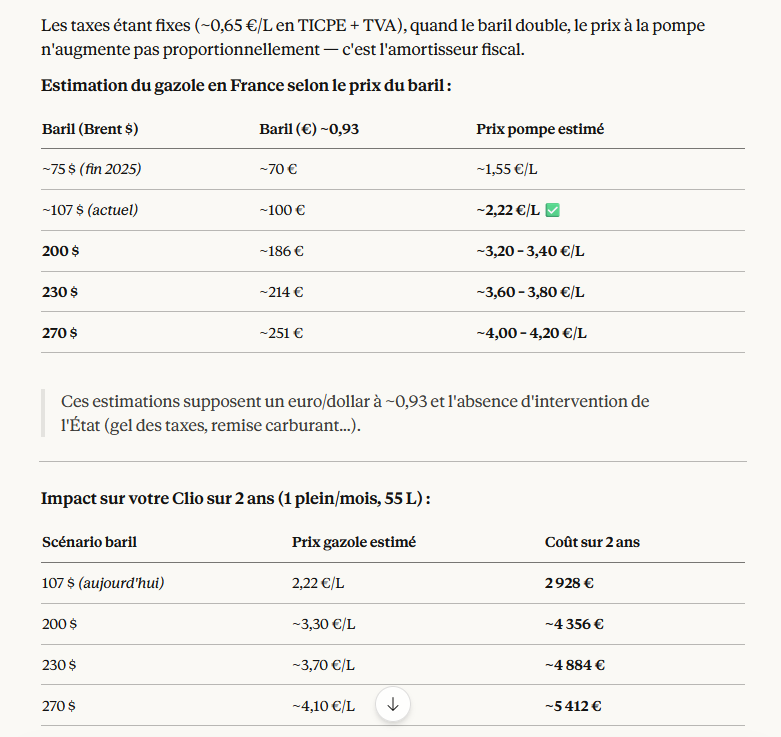
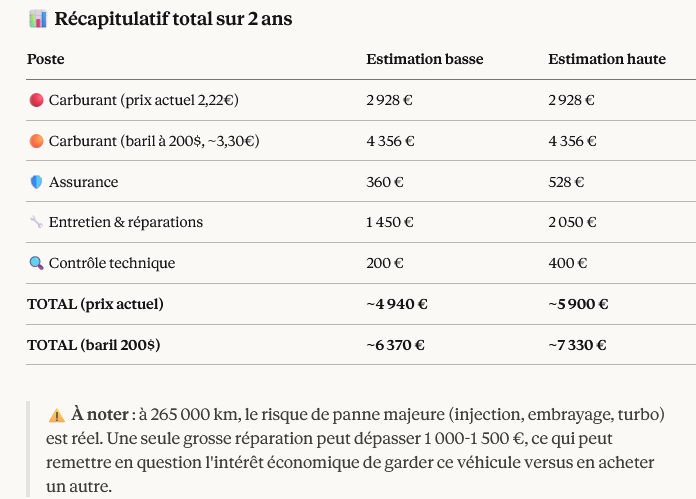
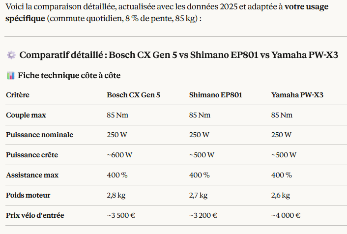

# Introduction 

L'objectif de l'étude est de visualiser un chemin pour passer de la voiture à un VAE pour les trajets du quotidien. 
Les contraintes sont : 
- environnement montagneux avec du dénivelé
- Etre assez puissant pour mes grosses fesses 85kg
  
## Evolution du prix du pétrole 

## Cout de la bagnole

## Trajets 
3 trajets aller-retour possibles :

### Hurtières-gare de Brignoud
- Trajet 1 : 9.9km - estimation 29min - chemin VTT-VTC - 506m de dénivelé -
- Trajet 2 : 13.2km - estimation 42min - 
chemin route - 506m de dénivelé -

### gare de Brignoud-Hurtières
- Trajet 1 : 9.1km;estimation 1h17min;chemin VTT-VTC;506m de dénivelé+

### Hurtières-Boulot Meylan 
- 23.8km;estimation 1h13;chemin VTT-VTC;549m_dénivelé-;44m_dénivelé+ 

### Boulot Meylan-Hurtières 
- 21.2km;estimation 1h45;chemin VTT-VTC;541m_dénivelé+;37m_dénivelé- 

### Hurtières-Boulot Grand Place
- 32.3km;esimation 1h41;chemin VTT-VTC;554m_dénivelé-;52m_dénivelé+ 

### Boulot Grand Place-Hurtières
- 30.6km;esimation 2h15;chemin VTT-VTC;546m_dénivelé+;44m_dénivelé- 

### St Martin d'Uriage-Boulot Grand Place
- 17.9km;estimation 55min;chemin route;526m_dénivelé-

### Boulot Grand Place-St Martin d'Uriage
- 16.3km;estimation 1h25min;chemin route;570m_dénivelé+

### St Martin d'Uriage-Boulot Meylan
- 17.3km; estimation 48min;chemin route;528m_dénivelé-

### Boulot Meylan-St Martin d'Uriage
- 15.3km; estimation 1h21min;chemin route;528m_dénivelé+

# Dimensionnement

## Masse totale
Moi : 85kg
Velo : 20kg 
bonus : 10kg
Total : 115 kg 

## Batterie

**calcul pour le trajet** :  
- 16.3km estimation 1h25min
- chemin route/VTC
- 600m_dénivelé+

**Energie**
115kg*9.81*600m~680000 J ~ 680000/3.6e3 ~188Wh 
1J=0.0002777Wh

Rendement moteur et transmission ~70-80%
pertes : vent, route, terrain 

Consommation réelle 250-300Wh pour le dénivelé   

Sur chemin VTC (rendement moyen à mauvais) : 10 à 15 Wh/km ~ 160–240 Wh

Wh = V × Ah 
Montée	250–300 Wh
Roulement	160–240 Wh
Total	410–540 Wh

Avec marge (froid, vieillissement batterie, vent, fatigue) :
Recommandé : 700 à 900 Wh de batterie

### Cible Batterie 48V - 10A ~ 480W  
### Cible Batterie 48V - 14A ~ 672W  
### Cible Batterie 48V - 20A ~ 960W 

## Moteur 

###  Bafang BBS02 250W  
- Capteur de couple (pas seulement de cadence) pour un feeling naturel
Batterie 48V 14Ah (~672 Wh) 

https://www.lift-mtb.com/produit/moteur-bafang-bbs02-250w/

- Fournisseurs français sérieux : Cycloboost (Bordeaux), Virvolt, À bicyclette Paulette

### Bafang BBS02 (750W)
### Bafang BBSHD (1000W)

# Recherche VAE premium existant 

https://www.bosch-ebike.com/fr/produits/performance-line-cx-bdu374y 

